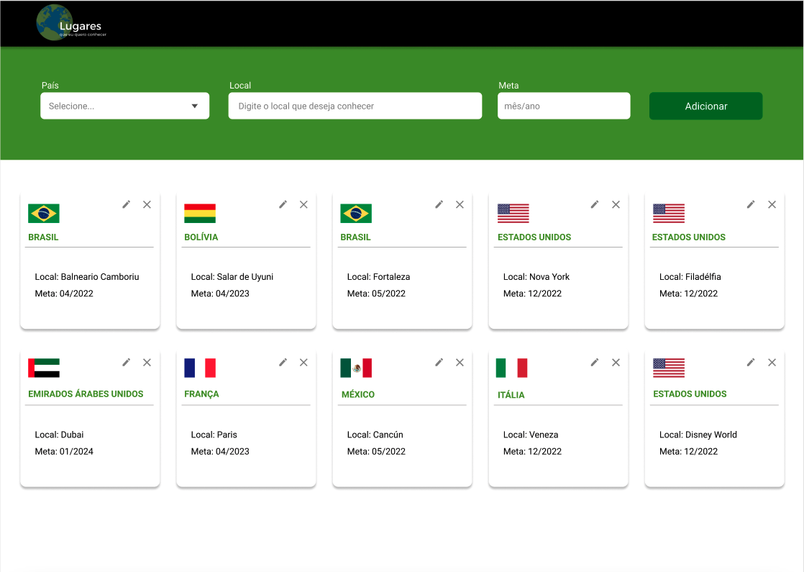
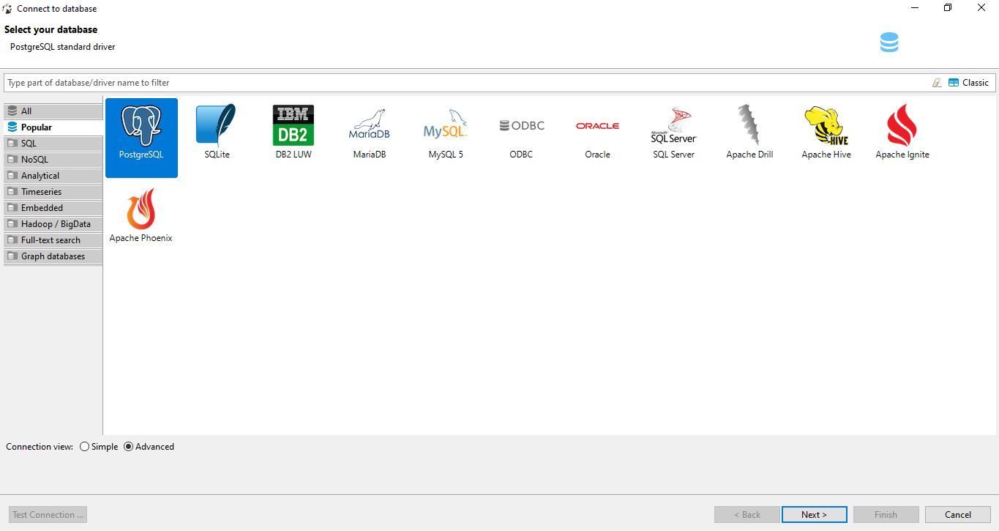
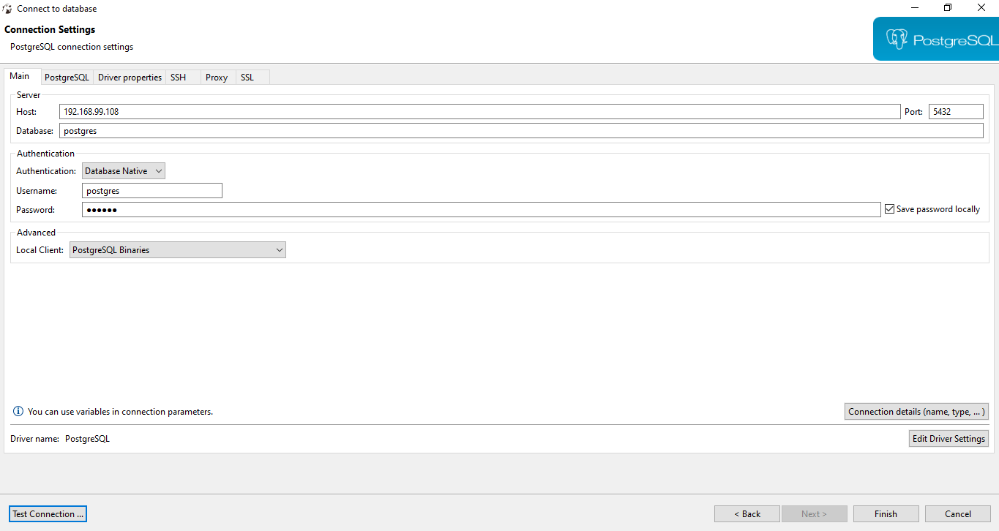
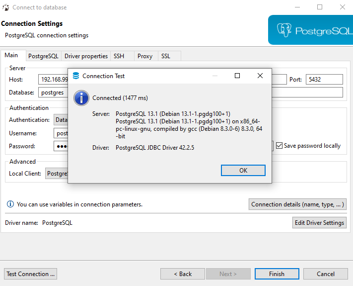
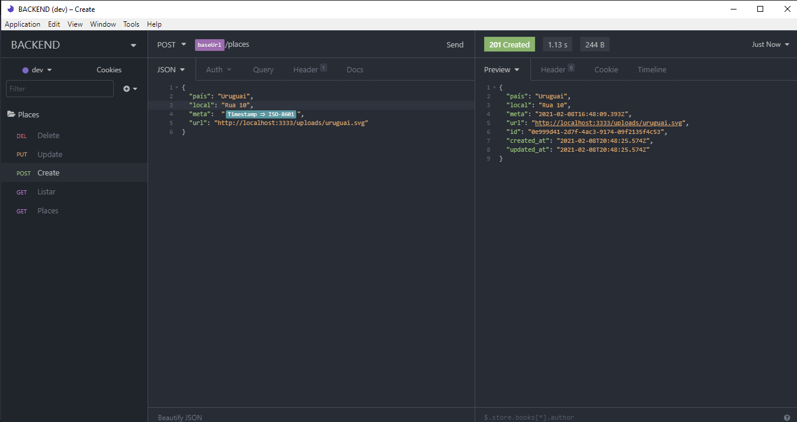
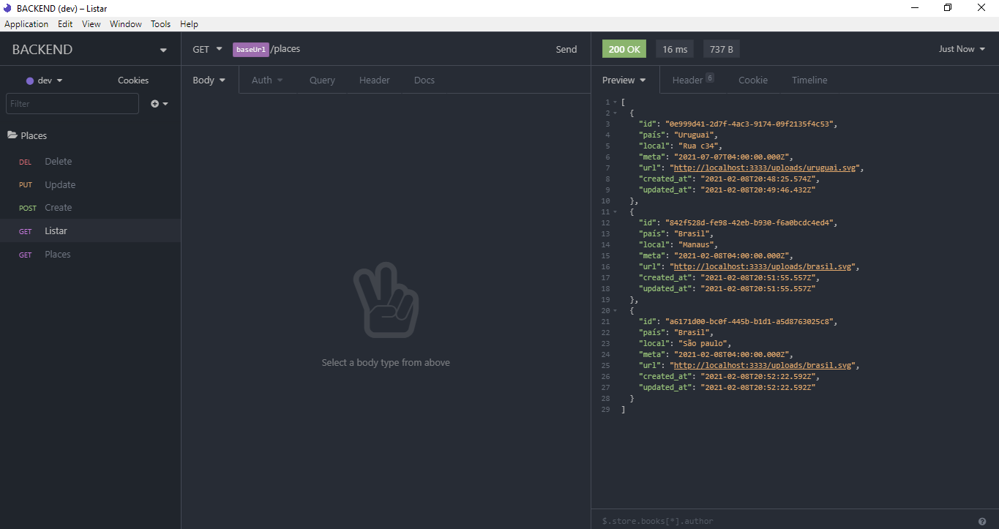
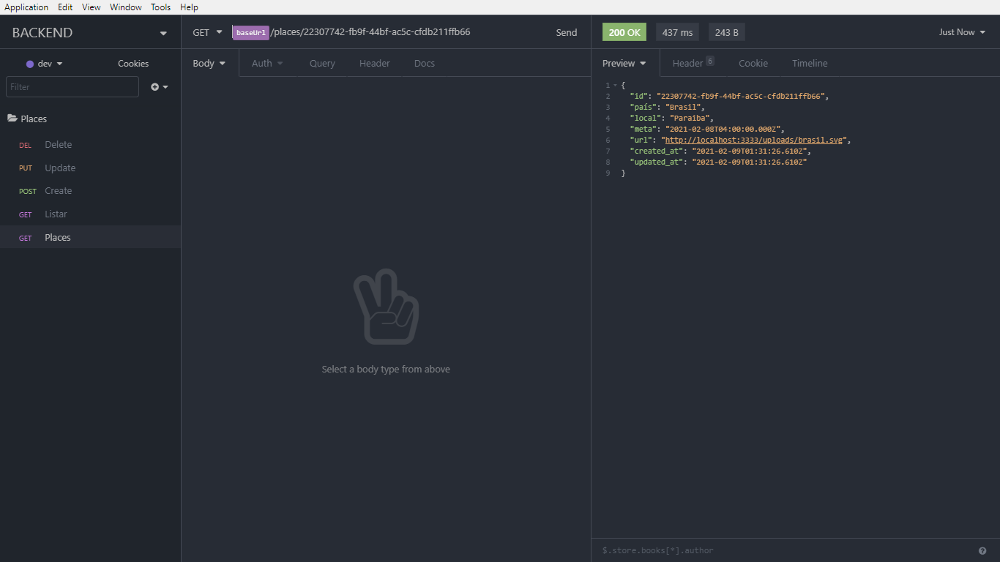
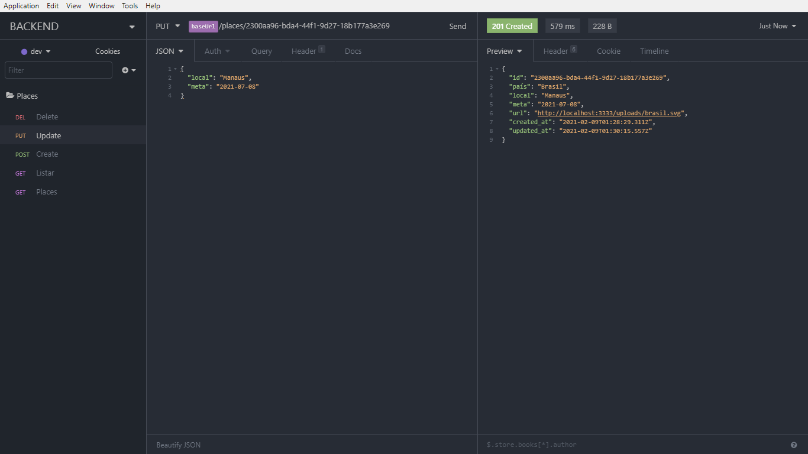
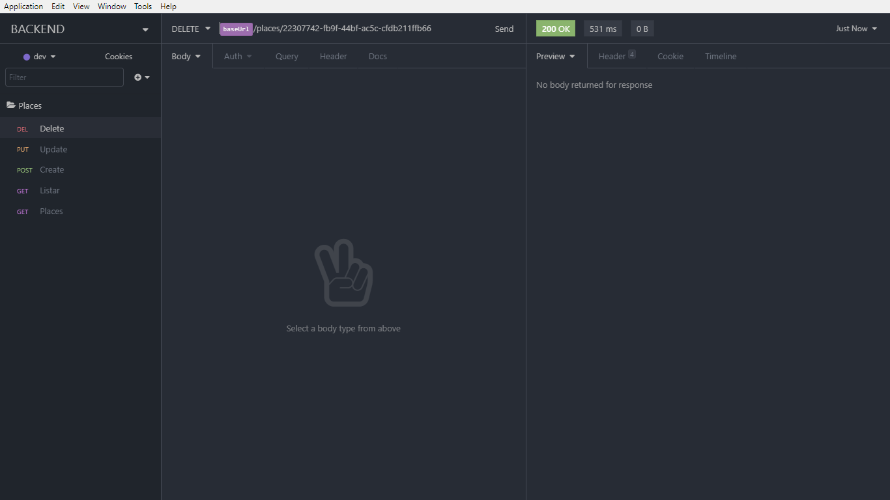

# Desafio de Backend


- [Descrição](#descrição)
  - [O Desafio](#o-desafio)
  - [Requisitos Obrigatórios](#requisitos-obrigatórios)
  - [Bônus](#bônus)
- [Submissão e Prazo de Entrega](#submissão-e-prazo-de-entrega)


## Descrição

Este desafio tem como objetivo avaliar as habilidades técnicas do candidato a vaga de desenvolvedor backend no Clubpetro.

#### O Desafio

O desafio consiste em desenvolver uma API rest que permita o CRUD de lugares para se conhecer ao redor do mundo para alimentar o frontend que pode ser visto na imagem a seguir:



Os dados a ser considerados são:

- País: O país escolhido;
- Local: O local dentro do país escolhido;
- Meta: O mês e o ano que o usuário pretende visitar o local;
- Url da bandeira do país;
- Data de criação do registro;
- Data de atualização do registro.

#### Requisitos Obrigatórios

> Requisitos que serão avaliados no desafio.

- A API deverá ser desenvolvida com Node.js e Express;
- Apenas o Local e a Meta poderão ser editados;
- O mesmo local em determinado país não poderá ser adicionado de forma duplicada;
- A listagem dos dados deverá ser ordenada de forma crescente pela meta;
- O candidato deverá adicionar ao projeto uma explicação de como executar a aplicação.

#### Bônus

> Requisitos que não são obrigatórios mas podem te deixar em vantagem com relação aos outros candidatos.

- Utilização do framework [NestJS](https://nestjs.com/);
- Typescript;
- Testes automatizados;
- [TypeORM](https://typeorm.io/#/);
- [Docker](https://www.docker.com/);
- Deploy para [Google Cloud Platform](https://cloud.google.com/) (ao criar conta é possível receber um bonus para teste).

### Submissão e Prazo de entrega

- O candidato deverá realizar um fork deste repositório e submeter o código no mesmo.
- Em caso do deploy realizado, a url deverá ser adicionada no README;
- O prazo de entrega para este desafio é de 2 (duas) semanas, contando a partir do dia em que o canditado recebeu o email com o link do repositório;
- Ao finalizar o desafio, o candidato deverá enviar um email para jobs@clubpetro.com.br contendo o link do seu PR.

### 🚀 Tecnologias
---
Este projeto foi desenvolvido com as seguintes tecnologias:
 
- [Nodejs](https://nodejs.org/en/)
- [Express](http://expressjs.com/pt-br/)
- [Typescript](https://docs.microsoft.com/pt-br/archive/msdn-magazine/2015/january/typescript-understanding-typescript)
- [TypeORM](https://typeorm.io/#/)
- [Docker](https://www.docker.com/)
- [VS Code](https://code.visualstudio.com/) com [EditorConfig](https://marketplace.visualstudio.com/items?itemName=EditorConfig.EditorConfig) e [ESlint](https://marketplace.visualstudio.com/items?itemName=dbaeumer.vscode-eslint)

### ❗ Como usar
---

>Para clonar e executar esse projeto, você precisa do [Git](https://git-scm.com/), [Nodejs v12.16](https://nodejs.org/en/) ou superior + [Yarn 1.22](https://yarnpkg.com/) ou superior  instalado no seu computador. Digite na sua linha de comando:

``` bash

    # Clonar o repositório
    $ git clone https://github.com/jhongomes/backend-challenge.git

    # Entrar no repositório
    $ cd backend-challenge

    # Instalar as dependências 
    $ yarn

    # Abrir projeto 
    $ code .


``` 
### 🔗 Banco de dados
---
 >Para estabelecer uma conexão com o banco, você precisa de [Docker v19.03](http://docs.docker.oeynet.com/toolbox/toolbox_install_windows/) ou superior instalado no seu computador. Digite na sua linha de comando:

 ``` bash
    # Criar uma imagem do postgres com docker
    $ docker run --name BACKEND -e POSTGRES_PASSWORD=docker -p  5432:5432 -d postgres
    
    # Executar o banco
    $ docker start BACKEND

    # Verificar a url host de conexão
    $ docker-machine ls

    # Configurar a url listada no comando acima dentro do 'ormconfig.json' do projeto backend
    ex url: 192.168.99.108

    # Execute o projeto
    $ yarn dev


    

``` 
### 💬 DBevear
---
> Para gerir uma administração das tabelas que serão migradas do projeto para o banco, você precise de [DBevear v7.2](https://dbeaver.io/download/) ou superior. Abra a interface e configure conforme as instruções a seguir:

- Selecione o banco PostgresSQL. Depois > Next




-  Preencha conforme a imagem a seguir. 
- Observação: Preencha o campo host conforme a conexão estabelecida pela sua máquina e sua senha conforme sua configuração. Depois > Finish



- Se a resposta for igual a imagem a seguir a conexão entre o docker e o DBevear está estabelecida.



---

### 📁 Migrations

> Para migrar a tabela existente no projeto para o DBevear, execute o comando no terminal do seu editor:

```
$ yarn typeorm migration:run
```
---
### 🟣 Insomnia

> Para testar a API desenvolvida você precisa de [Insomnia v7.1](https://insomnia.rest/) ou superior instalado no seu computador.

``` bash
  # Gerenciar ambiente com a rota
  $ { "baseUrl": "http://localhost:3333"  }
```
---
### Recursos para cadastrar as requisições

---
 Rota estática disponível para campo url. É importante constar que a somente alguns nomes de países disponivel no arquivo uploads. Com isto, deixo claro que é necessário colocar no final da rota o nome do país. Ex:
http://localhost:3333/uploads/brasil.svg ou http://localhost:3333/uploads/uruguai.svg.


> - <strong>POST /places</strong> : O corpo da requisição deve receber <strong>país</strong>, <strong>local</strong>, <strong>meta</strong> e <strong>url</strong>. Ex:



---

> - <strong>GET /places</strong>: Rota que lista todos os lugares cadastrados na Api. Ex:



---
> - <strong>GET /places/id</strong>: Rota retorna os dados de uma lugar específico. Deve ser passado por parâmetro o <strong>id</strong> do tipo <strong>uuid</strong>. Ex:



---
> - PUT /places/id : Rota deve alterar somente os campos <strong>local</strong> e 'meta' referente ao <strong>id</strong> passado por parâmetro




---

> - <strong>DELETE /places/id</strong> : O lugar com 
 <strong>id</strong> passado por parâmentro deve ser excluido e retornar somente um status 200. Ex:



---
Feito por:  Jhonatan Gomes ! 